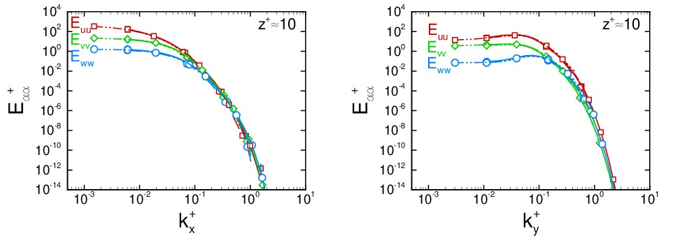

# 1D energy spectra
This repository contains source codes for calculating the 1D energy spectra in turbulent channel flows. The codes utilize parallel FFTW for efficient computation of the spectra.

The program is designed to perform computations in parallel. It is essential that the number of grid points in the streamwise direction is divisible by the total number of MPI ranks.

Parallel I/O operations are employed by the program. All input and output files are expected to reside on a shared file system.

## Getting Started

### Dependencies

* FFTW
  - The codes need to be linked vs FFTW. Instructions for building the parallel FFTW are listed at the end of this file.

### To Build
  1- Set the path to your FFTW library (FFTW) at the top of the Makefile

  2- type
```
  make 
```

### To Run
The code is designed to run in a parallel computing environment. Use the following command to execute the program:

* The code runs in parallel, using mpi:
```
mpirun -np N 1dspectra
```

Note that path to ''fftw/lib'' needs to be in your ''LD_LIBRARY_PATH''. Depending on your mpi library, this can be done differently. With OpenMPI, try '-x LD_LIBRARY_PATH', with Intel MPI, try '-genv LD_LIBRARY_PATH'.

### Input files
The program expects the following input file:

"vel.time" (e.g. vel.0001) : velocity file containing the instantaneous velocity field at time T, with array indices running from (0..Nx-1, 0..Ny-1, 0..Nz-1), where the indices go by first z index, then y index, then x 

#### Output files
The program generates the following output files:

E<sub>uu</sub>(x).time, E<sub>vv</sub>(x).time, E<sub>ww</sub>(x).time, corresponding the 1D energy spectra components in the streamwise (x) direction at the given time T and E<sub>uu</sub>(y).time, E<sub>vv</sub>(y).time, E<sub>ww</sub>(y).time, corresponding the 1D energy spectra components in the spanwise (y) direction at the given time T.

#### Postprocessing

To perform statistical analysis on the resulting data sets, first modify the input parameters at the top of `src/postproc-spectra.c`, then build the postprocessing component by typing
```
make postproc-spectra
```
then run the resulting binary 
```
./postproc-spectra
```

The postprocessing component requires the pressure gradient at every time step of the simulation, to calculate the wall shear stress and the resulting friction velocity. Additionally, the beginning and final time during which the statistical averages are to be calculated, along with the channel sizes, alpha and beta, where `Lx=2xPi/alpha` and `Ly=2xPi/beta`, need to be specified at the top of the source file. 

## Results

Due to the fine resolutions in the core region, accuracy of the spectra in the core is significantly higher than most of the published DNS databases. The tail of the spectra perfectly continues down to the Kolmogrov scale. Figures bellow demonstrate the 1D energy spectra obtained, using this code, at a distance of 10 wall units from the walls, in turbulent channel flow at a bulk Reynolds number of Reb=Ubxh/nu=7200. 



The results are in full agreement with the published DNS databases of Jimenez et al. and Moser et al. 


## Author

Amirreza Rastegari [@arstgr](https://github.com/arstgr)

## Version History

* 0.1
    * Initial Release

## License

This project is licensed under the GNU Affero general public License. Refer to the [LICENSE](LICENSE) file for more information.


## To Cite

If you use this code in your research, please cite the following work:

Rastegari, S.A., 2017. Computational studies of turbulent skin-friction drag reduction with super-hydrophobic surfaces and riblets ([Doctoral dissertation](https://deepblue.lib.umich.edu/handle/2027.42/136986)), the University of Michigan.

## Building FFTW
```bash
wget https://www.fftw.org/fftw-3.3.10.tar.gz
tar -xzvf fftw-3.3.10.tar.gz
mkdir fftw
FFTW=$(PWD)/fftw  #path to where fftw is to be installed
cd fftw-3.3.10
./configure --prefix=$FFTW  --enable-shared --enable-mpi
make 
make install
```